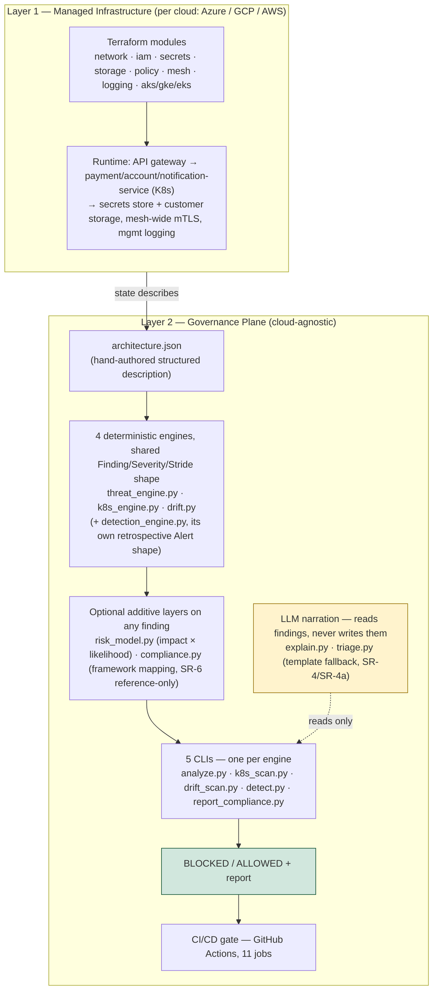
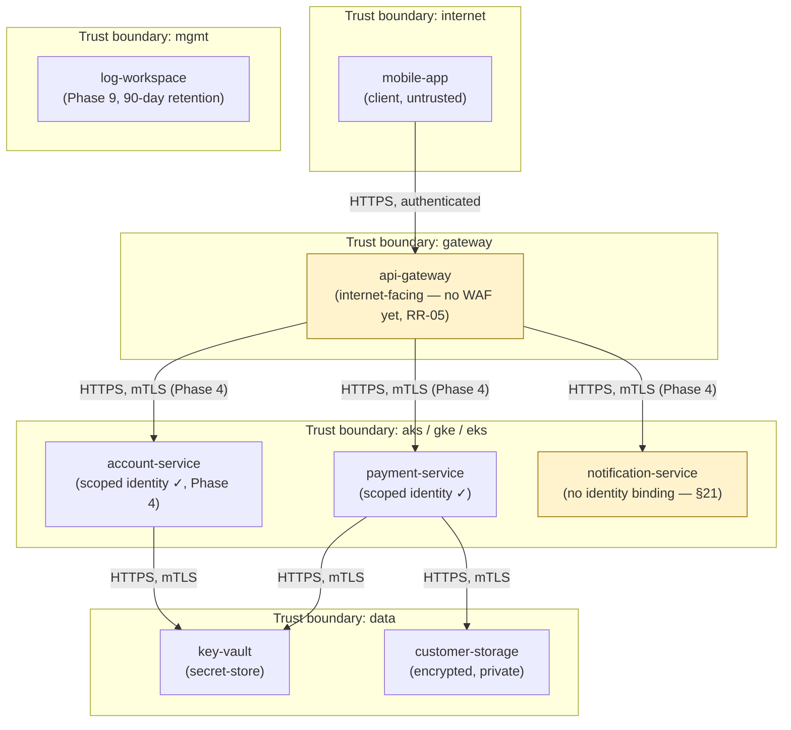
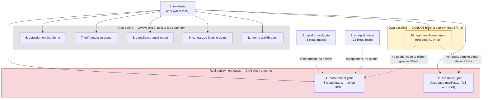
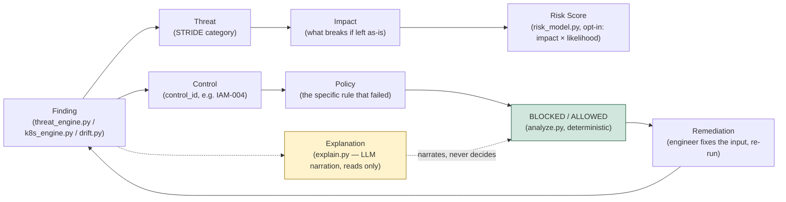

# Architecture Diagrams

Four diagrams, each grounded in real repository data at the time they were drawn (2026-09-23, post-Phase-11), not in an idealized or aspirational version of the system. The Mermaid source for each lives alongside this file in `docs/diagrams/*.mmd` and renders natively wherever GitHub displays a fenced ` ```mermaid ` block — including right here. A rendered PNG of each is also checked in under `docs/diagrams/*.png` for viewers without Mermaid support (rendered locally with `mmdc`, mermaid-cli v11.17.0).

None of these diagrams is a certification, an attestation, or a claim about a real deployment — SentinelCloud has never run `terraform apply` against a real cloud account (SR-6, cost discipline). They describe the codebase and its CI pipeline as they actually exist in this repository.

## 1. System layers

What it shows: the two-layer split that the spec (§7) has described since v1 — Layer 1 is the per-cloud managed infrastructure Terraform would provision and the runtime services that infrastructure hosts; Layer 2 is the cloud-agnostic governance plane that reasons about Layer 1's state. The two are connected by exactly one edge, "state describes" — Layer 2 never talks to a live cloud API, it only reads the structured `architecture.json` description of what Layer 1 is or would be.

Why it's drawn this way: this is the architectural decision that makes the "never `terraform apply`" cost-discipline constraint possible at all. Because Layer 2 operates purely on a JSON description, all of threat modeling, Kubernetes manifest scanning, drift detection, and compliance mapping run identically whether the described infrastructure is real or synthetic (Meridian Trust Bank's fictional environment). The diagram also encodes SR-4/SR-4a directly: the LLM narration layer (`explain.py`, `triage.py`) has a dotted "reads only" edge into the CLIs, never a solid edge into the decision box, because it narrates findings after the deterministic engines have already produced them — it cannot add, suppress, or reweight a finding.

Real data behind it: the four engines (`agent/threat_engine.py`, `agent/k8s_engine.py`, `agent/drift.py`, `agent/detection_engine.py`), the two optional additive layers (`agent/risk_model.py`, `agent/compliance.py`), the five CLIs (`analyze.py`, `k8s_scan.py`, `drift_scan.py`, `detect.py`, `report_compliance.py`), and the CI/CD gate's current job count (11, confirmed by `grep -c "jobs:"` never — actual count taken from `.github/workflows/security-gate.yml`'s 11 named jobs, verified when CI job 11 was added in Phase 11).



## 2. Trust boundaries and current flows

What it shows: every asset and flow in `threat-model/architecture-hardened.json` — the actual hardened architecture the engines and CI gate evaluate today — grouped by the five trust boundaries the spec defines (internet, gateway, aks/gke/eks, data, mgmt). This is not a generic reference diagram; it is a direct rendering of that JSON file's `assets`, `flows`, and `trust_boundaries` arrays, re-verified against the file immediately before this diagram was drawn.

Why it's drawn this way: two assets are highlighted deliberately, not decoratively. `api-gateway` is flagged as internet-facing with no WAF yet (residual risk RR-05 — an open, tracked gap, not an oversight). `notification-service` is flagged as having no identity binding at all — this is the one incompleteness the spec's §21 now documents honestly after Phase 11's correction: `account-service` was given a scoped identity in Phase 4 (closing what earlier spec drafts called out as a gap), but `notification-service` still has `role: null` in the architecture file. It doesn't appear in the residual risk register's open findings, and that omission is correct: `rule_missing_identity` in `threat_engine.py` only fires for a compute asset whose outbound flows reach a sensitive asset type (`database`, `storage`, `secret-store`), and `notification-service` has zero outbound flows in the hardened architecture — so the engine has nothing to flag. That is a real, verified property of the ruleset, not an assumption.

Real data behind it: `threat-model/architecture-hardened.json` (all 8 assets, all flows, all 5 trust boundaries), `agent/threat_engine.py` lines ~153–178 (`rule_missing_identity`, `SENSITIVE_TYPES = {"database", "storage", "secret-store"}`).



Note: `log-workspace` has no inbound flow edges in the hardened architecture file itself — services feed it via the logging module's instrumentation rather than a flow declared in `architecture-hardened.json`, which is why it appears without arrows here. That is a property of how the architecture file models logging, not a gap in this diagram.

## 3. CI/CD pipeline and the SR-4a boundary

What it shows: all 11 jobs in `.github/workflows/security-gate.yml`, grouped by what they can actually do to a merge. Two jobs are real deployment gates that can block a pull request (`threat-model-gate`, `k8s-manifest-gate`, both run with `--fail-on HIGH` across the 3-cloud matrix / hardened manifests). Five jobs are non-gating demonstrations that always exit 0 and post their output to the job summary. One job — `agent-eval-benchmark` — is drawn in its own subgraph because its exit code genuinely can fail (it's grading the LLM explanation layer's output quality), but it has no `needs:` dependency edge into either gate.

Why it's drawn this way: that missing edge is the single most load-bearing fact in this diagram, and it's drawn as an explicit dotted red-crossed line rather than left as an absence, because an absence is easy to miss and this is the one property that makes SR-4a ("AI quality can never affect a deployment decision") true by construction rather than by policy. If a future contributor ever adds a `needs: agent-eval-benchmark` edge to either gate, this diagram becomes wrong the moment that happens — which is the point: it's meant to be checked against the real workflow file, not trusted from memory.

Real data behind it: `.github/workflows/security-gate.yml` (11 jobs, their `needs:` graph, `--fail-on HIGH` flags), `docs/ci-cd.md`.



## 4. From finding to decision

What it shows: the shape a single finding takes as it moves through the system, from the moment one of the three design/log/drift-time engines produces it, to the deterministic BLOCKED/ALLOWED decision, to the remediation loop back to the source. Two branches run off every `Finding`: an optional scoring branch (STRIDE category → impact → `risk_model.py`'s opt-in risk score) and the enforcement branch (control ID → policy → `analyze.py`'s deterministic decision). A third, separate branch — explanation — reads the same finding but produces no input to the decision at all.

Why it's drawn this way: this is the diagram form of SR-4/SR-4a stated as a data-flow fact rather than a policy statement. `explain.py` has a dotted line into the Finding box (it reads findings) and a dotted "narrates, never decides" line to the decision box — never a solid line, because a solid line into a decision box would mean the explanation could influence the outcome, and that's exactly the architecture this project is built to prevent. The remediation loop closing back to `Finding` reflects how the system is actually used: an engineer fixes the underlying input (architecture JSON, Kubernetes manifest, or infrastructure state) and re-runs the relevant CLI — there's no "acknowledge and suppress" path in the engines.

Real data behind it: the shared `Finding`/`Severity`/`Stride` dataclass definitions in `agent/threat_engine.py` (reused by `k8s_engine.py` and `drift.py`; `detection_engine.py` uses its own `Alert` shape), `agent/risk_model.py`, `agent/compliance.py`, `agent/explain.py`, `agent/triage.py`, `analyze.py`'s BLOCKED/ALLOWED output.



## Known limitation of this documentation

These four diagrams supersede the ASCII diagrams in spec §7 as the current visual reference — §7's Layer 1 diagram was corrected in place during this same pass (its unauthenticated-flow and empty-mgmt-subnet claims were both stale, closed by Phase 4 and Phase 9 respectively), but §7's Layer 2 diagram was left as originally drawn and is now understated: it predates `k8s_engine.py`, `drift.py`, `detection_engine.py`, `risk_model.py`, `compliance.py`, `triage.py`, the logging module, and the agent evaluation harness. Diagram 1 above is the accurate replacement for that view. §7 itself now contains a note pointing here rather than silently going stale a second time.
